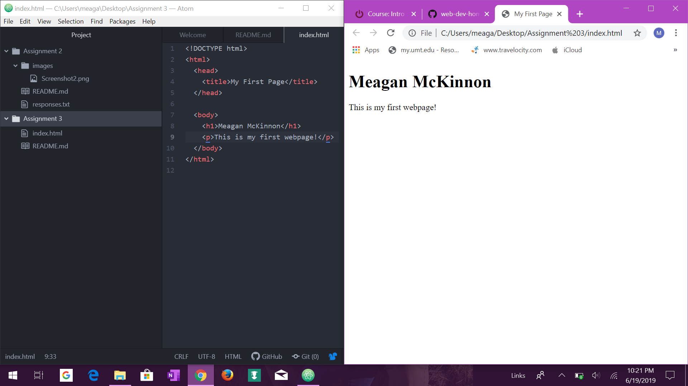

1- Each time a browser loads  a web page it processes the html which may include text or an image.

2- Descriptive Markup is used to label parts of a document as to how they should be treated.

3- 
